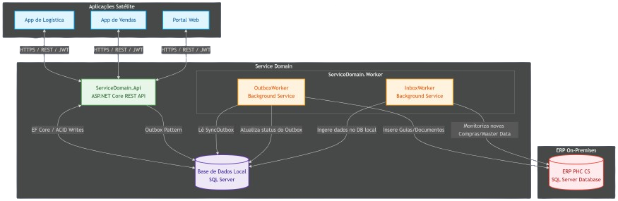

# Service Domain: Integração ERP PHC CS

O **Service Domain** é um serviço intermediário robusto e de alta velocidade desenvolvido em .NET 8. Atua como um proxy local de dados para aplicações satélite (App de Logística, App de Vendas e Portal Web), desacoplando o ERP PHC CS (On-Premises) de acessos concorrentes massivos e garantindo resiliência e operação offline parcial através do padrão **Transactional Outbox**.

---

## 📌 Principais Funcionalidades

* **Sincronização Bidirecional / Unidirecional com o PHC CS:**
  * **Produtos e Lotes:** Unidirecional (ERP PHC $\rightarrow$ Service Domain).
  * **Clientes e Stocks:** Bidirecional (ERP $\leftrightarrow$ Service Domain).
  * **Encomendas de Clientes:** Criação local na API com sincronização em tempo real para o ERP.
  * **Encomendas de Fornecedores:** Ingestão do ERP para planeamento de receção na logística local.
  * **Logística (Picking e Receção):** Confirmação física local com envio assíncrono para o ERP na forma de Guias de Remessa e Receção.
* **Padrão Outbox Transacional:** As operações de escrita de API garantem atomicidade ACID entre o registo local e a fila de sincronização (`SyncOutbox`).
* **Background Workers Independentes:** Sincronização em segundo plano resiliente a falhas temporárias de rede ou do ERP.

---

## 🗺️ Arquitetura e Comunicação entre Módulos

O diagrama abaixo ilustra o fluxo de comunicação e a arquitetura geral do sistema, conectando as aplicações satélite, a API local, a base de dados do Service Domain e o ERP PHC CS:




---

## 📁 Estrutura do Projeto

A solução está organizada em três projetos principais e um projeto de testes:

```
service_domain/
├── src/
│   ├── ServiceDomain.Core/     # Biblioteca comum (Entidades, DbContext, Migrações)
│   ├── ServiceDomain.Api/      # WebAPI ASP.NET Core (Controladores REST e DTOs)
│   └── ServiceDomain.Worker/   # Background Services (InboxWorker e OutboxWorker)
├── tests/
│   └── ServiceDomain.Tests/    # Suite de Testes xUnit (Mock InMemory)
├── coverlet.runsettings        # Configurações de cobertura de código
├── DESIGN.md                   # Especificação detalhada de arquitetura e decisões
├── api_tests.http              # Ficheiro de testes rápidos de endpoints HTTP
├── db_migration_initial.sql    # Script SQL completo de DDL da BD local
└── phc_trigger_table.sql       # Script de integração na base de dados do PHC
```


---

## 🚀 Como Começar

### Pré-requisitos
* [.NET 8.0 SDK](https://dotnet.microsoft.com/download/dotnet/8.0)
* [SQL Server](https://www.microsoft.com/sql-server/) (local ou via Docker)

### 1. Configuração de Conexão
Atualize as strings de ligação no ficheiro `appsettings.json` nos projetos **ServiceDomain.Api** e **ServiceDomain.Worker**:

```json
{
  "ConnectionStrings": {
    "DefaultConnection": "Server=localhost;Database=ServiceDomainDb;Trusted_Connection=True;TrustServerCertificate=True;",
    "PhcDbConnection": "Server=phc-server;Database=PHC_DB;User Id=sa;Password=your_password;TrustServerCertificate=True;"
  }
}
```

### 2. Migrações da Base de Dados Local
Para criar e estruturar a base de dados do Service Domain, execute a partir da raiz da solução:
```bash
# Instalar a ferramenta de EF Core se necessário
dotnet tool install --global dotnet-ef

# Aplicar as migrações locais
dotnet ef database update --project src/ServiceDomain.Core --startup-project src/ServiceDomain.Api
```

### 3. Execução dos Serviços
Pode iniciar a WebAPI e o Background Worker separadamente:

```bash
# Iniciar a WebAPI (Disponível em http://localhost:5000 / https://localhost:5001)
dotnet run --project src/ServiceDomain.Api

# Iniciar o Sincronizador de Background
dotnet run --project src/ServiceDomain.Worker
```

---

## 📡 Endpoints da WebAPI

### Clientes
* `GET /api/clientes` — Lista todos os clientes sincronizados localmente.
* `POST /api/clientes` — Cria um cliente localmente e agenda a sua sincronização para o PHC.

### Encomendas
* `GET /api/encomendas` — Consulta encomendas de clientes (suporta filtros por `clienteNo` e `status`).
* `GET /api/encomendas/{id}` — Detalhe de uma encomenda específica e suas linhas.
* `POST /api/encomendas` — Submete uma nova encomenda com cálculo de totais e integração no `SyncOutbox`.

### Artigos e Stock
* `GET /api/produtos` — Consulta catálogo de produtos (filtros por `searchRef` e `searchDesignacao`).
* `GET /api/stocks` — Consulta stock atualizado (filtros por `refCode`, `loteCodigo`, `armazem` e `localizacao`).
* `POST /api/stocks/movimentos` — Regista movimentação de stock (inventário/ajustes) com validação contra stock negativo.

### Logística (Picking & Entrada de Compras)
* `GET /api/logistica/picking/pendentes` — Lista encomendas de cliente com picking pendente (sincronizadas do ERP).
* `POST /api/logistica/picking` — Confirma o picking efetuado na prateleira, gera a `GuiaRemessa` e enfileira para escrita assíncrona nas tabelas `bo`/`bi` do PHC.
* `GET /api/logistica/rececao/pendentes` — Lista encomendas de fornecedores prontas para receber.
* `POST /api/logistica/rececao` — Regista a receção de mercadoria do fornecedor, atualiza fisicamente o stock local nas prateleiras indicadas e gera a `GuiaRececao` para o ERP.

---

## 🧪 Testes Automatizados e Cobertura de Código

A suite de testes utiliza **xUnit** e base de dados em memória do EF Core para simular as transações atómicas sem requerer uma base de dados física ativa.

### Executar a Suite de Testes
Para correr todos os testes unitários e de integração:
```bash
dotnet test
```

### Coleta de Cobertura de Código (Code Coverage)
Para correr os testes recolhendo as estatísticas de cobertura filtradas pelo ficheiro `.runsettings` (excluindo migrações e Workers):
```bash
dotnet test --settings coverlet.runsettings --collect:"XPlat Code Coverage"
```

### Resultados de Cobertura Consolidados
* **Total de Testes:** 27 testes com 100% de aprovação (Passed).
* **Cobertura Global de Linhas:** **88,70%**
* **Cobertura Global de Ramos (Branches):** **72,50%**
* **Cobertura por Controlador API:**
  * `ClientesController`: 100,00%
  * `EncomendasController`: 100,00%
  * `LogisticaController`: ~90% de cobertura de linhas.
  * `ProdutosController`: 100,00%
  * `StocksController`: 100,00%
